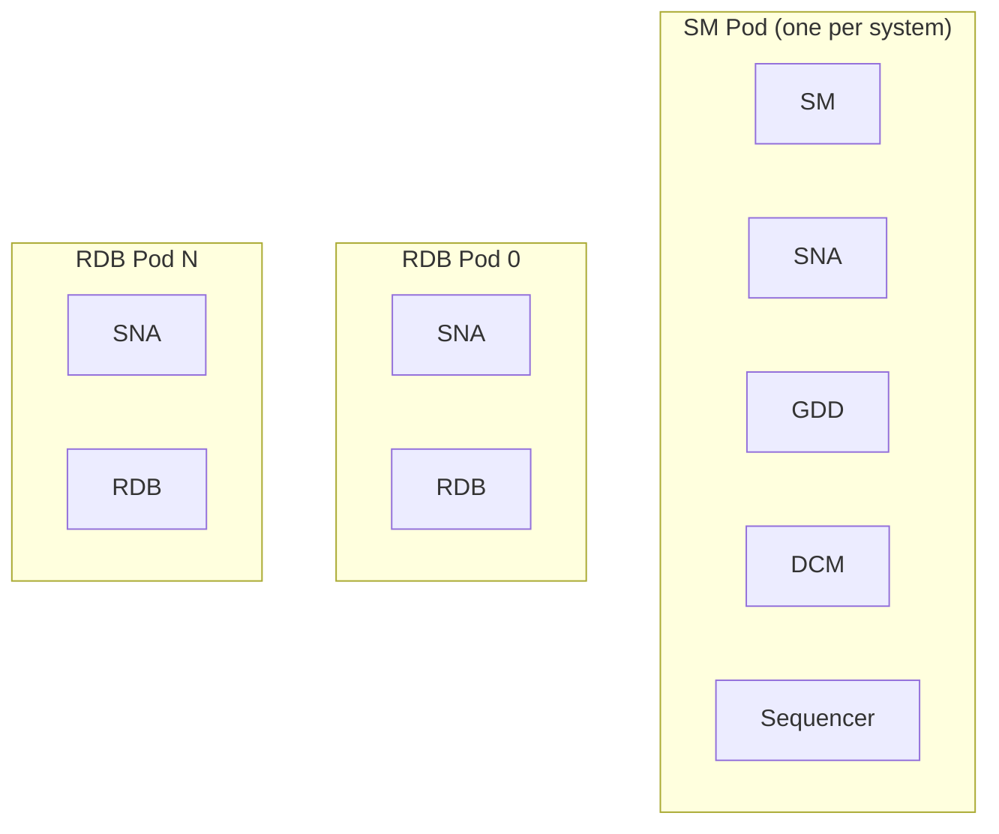

# Regatta Kubernetes Operator Guide

> **Note:** This guide assumes you are already familiar with the
> [RegattaDB software modules](https://docs.regatta.dev/self-hosted-deployment/manual-deployment/regattadb-software-modules)
> (SM, SNA, GDD, DCM, Sequencer, RDB) and how they work together in a
> RegattaDB deployment.

The **Regatta operator** is a Kubernetes controller that automates deploying
and operating RegattaDB on Kubernetes. Instead of manually creating the
Kubernetes resources RegattaDB needs, provisioning its storage, and issuing
System Manager (SM) commands yourself, you describe the RegattaDB deployment
you want in a single `RegattaCluster` resource and let the operator drive
Kubernetes and RegattaDB into that state.

## Kubernetes Concepts You Will Use

| Concept | What it means for this guide |
| --- | --- |
| [Pod](https://kubernetes.io/docs/concepts/workloads/pods/) | Where one or more RegattaDB modules run together; see [Deployment Architecture](#deployment-architecture) below |
| [Kubernetes node](https://kubernetes.io/docs/concepts/architecture/nodes/) | A physical or virtual machine that can run Pods. Kubernetes places Pods on nodes automatically |
| [StatefulSet](https://kubernetes.io/docs/concepts/workloads/controllers/statefulset/) | Keeps a fixed, ordered set of Pods running with stable identities and their own storage. The operator creates one StatefulSet for the SM Pod and one for the RDB Pods |
| [Service](https://kubernetes.io/docs/concepts/services-networking/service/) | A stable network name and address for one or more Pods, even as Pods restart or move between Kubernetes nodes |
| [`PersistentVolumeClaim` (PVC)](https://kubernetes.io/docs/concepts/storage/persistent-volumes/#persistentvolumeclaims) | A request for storage that Kubernetes binds to an actual storage volume or device |
| [Raw block volume](https://kubernetes.io/docs/concepts/storage/persistent-volumes/#raw-block-volume-support) | A storage device given to a Pod directly, the same way you would give RegattaDB a raw block device in a manual deployment, without a filesystem in between |
| [CustomResourceDefinition (CRD)](https://kubernetes.io/docs/concepts/extend-kubernetes/api-extension/custom-resources/) | Registers `RegattaCluster` (full name `regattaclusters.regatta.dev`, short names `regatta`/`rgc`, usable in place of `regattacluster` in `kubectl`) as a Kubernetes resource type, so Kubernetes can store, validate, and let the operator watch it |
| [`spec`](https://kubernetes.io/docs/concepts/overview/working-with-objects/#object-spec-and-status) | The part of your `RegattaCluster` resource where you write the state you want; only you (and the operator's own defaults) ever set it |
| [`status`](https://kubernetes.io/docs/concepts/overview/working-with-objects/#object-spec-and-status) | The part of your `RegattaCluster` resource where the operator reports the state it observed; never edit it yourself |
| [Operator](https://kubernetes.io/docs/concepts/extend-kubernetes/operator/) | The program that continuously watches your `RegattaCluster` resource and keeps Kubernetes and RegattaDB matching it |

## What the operator does for you

- **Describes your deployment as a single Kubernetes resource**: the
  `RegattaCluster` resource captures the RegattaDB version, image, module
  settings, storage, and resource sizing you want.
- **Creates and maintains the Kubernetes resources RegattaDB needs**:
  StatefulSets, Services, ConfigMaps, and storage claims, generated and kept
  in sync automatically.
- **Configures and starts RegattaDB for you**: once Kubernetes resources are
  ready, the operator configures RegattaDB modules and starts or stops
  RegattaDB through the System Manager (SM).
- **Reports readiness continuously**: Kubernetes and RegattaDB health are
  reflected in the `RegattaCluster` status, so you always know the current
  state.

This file is the documentation source for the `README.md` included at the
root of the release package.

## The Package

You receive a single archive:

```text
regatta-k8s-<version>-<architecture>.tar.gz
```

It contains everything you need to import RegattaDB and the operator into
your own environment and install them on Kubernetes:

- The RegattaDB workload image (the container that runs RegattaDB itself).
- The Regatta operator image.
- The Kubernetes API definition (CRD) for `RegattaCluster`.
- The operator's Kubernetes identity and permissions.
- The operator Deployment.
- RegattaDB deployment examples you can edit.
- This guide.
- Licensing and third-party attribution files.
- Release metadata and integrity checksums.

## Package Structure

Extracting the archive gives you the following layout:

```text
regatta-k8s-<version>-<architecture>/
├── README.md
├── LICENSE
├── THIRD_PARTY_NOTICES
├── CHANGELOG.md
├── MANIFEST.json
├── SHA256SUMS
├── images/
│   ├── regatta-db-<version>-<architecture>.tar
│   └── regatta-operator-<version>-<architecture>.tar
└── config/
    ├── crd/
    │   └── regattacluster-crd.yaml
    ├── rbac/
    │   ├── serviceaccount.yaml
    │   ├── role.yaml
    │   ├── rolebinding.yaml
    │   └── clusterrole-readonly.yaml
    ├── operator/
    │   └── deployment.yaml
    └── examples/
        ├── regatta-minimal.yaml
        ├── regatta-full.yaml
        └── regatta-static-storage.yaml
```

Later sections describe each of these files in detail, at the point where you
actually use them: during installation, storage configuration, and
`RegattaCluster` creation.

## Deployment Architecture

In a manual or RDT-driven RegattaDB deployment, you decide which node runs
which modules: one SM, one SNA on every node that hosts an operational
module, one GDD, one DCM, one Sequencer, and one or more RDB modules. On
Kubernetes, a **Pod** is the unit that runs one or more RegattaDB modules
together, the same role a node plays in a manual deployment. The operator
places modules for you, using the following default layout:

| Pod | Count | Modules running in this Pod |
| --- | --- | --- |
| SM Pod | One per RegattaDB system | SM, SNA, GDD, DCM, Sequencer |
| RDB Pod | One for every RDB replica you configure | SNA, RDB |



Unlike a manual deployment, you do not choose per-Pod module placement here.
The operator uses this default layout; the only placement decision you make
today is how many RDB replicas to configure.

Each Pod also gets one or more stable Kubernetes Services, giving it a fixed
network address, similar to assigning a fixed internal IP address to each
node in a manual deployment. The SM Pod has one Service, and every RDB Pod
has its own dedicated Service, so its address does not change even if
Kubernetes moves the Pod to a different Kubernetes node.

A **Kubernetes node** is a physical or virtual machine in your Kubernetes
cluster. It is a different concept from the node used in manual RegattaDB
deployment guides: a single Kubernetes node can run many Pods at once,
including Pods belonging to other applications, and Kubernetes decides which
node each Pod runs on and can move a Pod to a different node later. You do
not assign RegattaDB modules to specific Kubernetes nodes yourself, though
you can influence which Kubernetes nodes the operator's Pods are eligible to
run on using standard scheduling controls; see
[Schedule Pods](#schedule-pods).

Later sections describe how to install the operator and walk through
creating your first `RegattaCluster` resource, including what the operator
does after you apply it.

## Prerequisites

Before you start, make sure you have:

- Access to a Kubernetes cluster, with a `kubeconfig` that can create
  namespaces and install a CustomResourceDefinition, RBAC, and a Deployment.
- A namespace to install into. This guide uses `<namespace>` as a
  placeholder for the Kubernetes namespace where you want the operator and
  RegattaDB to run.
- A registry reachable from every Kubernetes node that will run RegattaDB or
  the operator, and any credentials it requires for image pulls.
- Enough CPU and RAM on your Kubernetes nodes for the SM Pod and every RDB
  Pod you plan to run (see Deployment Architecture).
- Filesystem storage for RegattaDB's repo and log directories, through a
  `StorageClass` or pre-created `PersistentVolumes`.
- Raw block storage for RDB, through a `StorageClass` or pre-created
  `PersistentVolumes` that support Kubernetes `volumeMode: Block`. RDB always
  uses raw block storage. This is not limited to local physical disks:
  any `StorageClass` or CSI driver that can present a raw block device works,
  including SAN, NVMe-oF, and distributed-filesystem vendor drivers that
  provision block-mode volumes backed by their own storage. Non-root access
  to raw devices, including any container-runtime configuration it requires,
  is covered later in this guide.

## Extract And Verify The Package

```sh
tar -xzf regatta-k8s-<version>-<architecture>.tar.gz
cd regatta-k8s-<version>-<architecture>
sha256sum --check SHA256SUMS
```

Do not continue if the checksum verification fails.

## Import Images Into Your Registry

1. Import and push each image archive to your registry. The recommended
   tool is `skopeo`, because it copies an image archive directly into a
   registry without needing a local container runtime, and preserves the
   exact image digest instead of rebuilding the image. `docker load` and
   `podman load` followed by `docker push`/`podman push` also work with
   these archives if you prefer a tool you already have installed:

   ```sh
   skopeo copy \
     docker-archive:images/regatta-db-<version>-<architecture>.tar \
     docker://registry.example.com/regatta-db:<version>

   skopeo copy \
     docker-archive:images/regatta-operator-<version>-<architecture>.tar \
     docker://registry.example.com/regatta-operator:<version>
   ```

2. Record the digest your registry assigns to each uploaded image:

   ```sh
   skopeo inspect docker://registry.example.com/regatta-db:<version> \
     --format '{{.Digest}}'
   skopeo inspect docker://registry.example.com/regatta-operator:<version> \
     --format '{{.Digest}}'
   ```

   You will use these digests in the next step, as part of a full image
   reference such as:

   ```text
   registry.example.com/regatta-operator@sha256:1a2b3c4d5e6f...
   ```

## Point The Manifests At Your Registry

1. In `config/operator/deployment.yaml`, set the operator container image to
   your uploaded operator image and digest.
2. In the example you plan to use under `config/examples/`, set
   `spec.image` to your uploaded RegattaDB image and digest.
3. If your registry requires authentication, create a Kubernetes Secret of
   type `kubernetes.io/dockerconfigjson` in `<namespace>`, then reference it
   in `imagePullSecrets` in `config/operator/deployment.yaml` for the
   operator image, and in `spec.image.pullSecrets` in your `RegattaCluster`
   example for the RegattaDB image.

## Install The Operator

1. Create the namespace:

   ```sh
   kubectl create namespace <namespace>
   ```

2. Install the CustomResourceDefinition:

   ```sh
   kubectl apply -f config/crd/regattacluster-crd.yaml
   ```

3. Install the operator's Kubernetes identity and permissions:

   ```sh
   kubectl -n <namespace> apply -f config/rbac/serviceaccount.yaml
   kubectl -n <namespace> apply -f config/rbac/role.yaml
   kubectl -n <namespace> apply -f config/rbac/rolebinding.yaml
   ```

4. Install the cluster-scoped read-only permission the operator needs. This
   is required so the operator can discover its configured namespace and the
   `RegattaCluster` resource type, and recover existing resources after a
   restart. The same permissions also let it validate static RDB
   `PersistentVolumes` and `StorageClasses` before applying resources:

   ```sh
   kubectl apply -f config/rbac/clusterrole-readonly.yaml
   ```

   Its default binding targets the `regatta-operator` `ServiceAccount` in the
   `regatta` namespace. If `<namespace>` is not `regatta`, edit the
   `ClusterRoleBinding`'s subject namespace before applying it.

5. Install the operator Deployment:

   ```sh
   kubectl -n <namespace> apply -f config/operator/deployment.yaml
   ```

6. Verify that the operator is running:

   ```sh
   kubectl -n <namespace> rollout status deployment/regatta-operator
   kubectl -n <namespace> get pods -l app.kubernetes.io/name=regatta-operator,app.kubernetes.io/component=operator
   kubectl -n <namespace> logs deployment/regatta-operator
   ```

Later sections walk through creating your first `RegattaCluster` resource.
The operator is running at this point, but RegattaDB itself does not exist
yet: nothing runs RegattaDB until you apply a `RegattaCluster` resource.

## Create Your First RegattaCluster Resource

A minimal `RegattaCluster` resource looks like this:

```yaml
apiVersion: regatta.dev/<crd-api-version>
kind: RegattaCluster
metadata:
  name: my-regattadb
  namespace: <namespace>
spec:
  version: "<version>"
  image:
    repository: registry.example.com/regatta
    tag: "<version>"
  security:
    runAsUser: 1000
    runAsGroup: 1001
    fsGroup: 1001
  rdb:
    replicas: 3
    blockStorage:
      size: 60Gi
  repoStorage:
    size: 5Gi
  logs:
    size: 5Gi
```

Save it to a file under `config/examples/`, then apply it:

```sh
kubectl -n <namespace> apply -f config/examples/regatta-minimal.yaml
kubectl -n <namespace> get regattaclusters
```

`spec.version`, `spec.image`, `spec.rdb`, `spec.repoStorage`, and
`spec.logs` are required. The rest of this section walks through every
field.

## Configure The Object Header

| Field | Description |
| --- | --- |
| `apiVersion` | `regatta.dev/<crd-api-version>` |
| `kind` | `RegattaCluster` |
| `metadata.name` | A unique, DNS-compatible name. It is used to name every generated resource, so keep the total generated names under 63 characters |
| `metadata.namespace` | The namespace where you installed the operator |

## Configure Version And Image

| Field | Required/default | Description |
| --- | --- | --- |
| `spec.version` | Required; immutable after creation | The RegattaDB release version. It must match the release built into your image |
| `spec.image.repository` | Required | The RegattaDB image repository in your registry |
| `spec.image.tag` | Required unless `digest` is set | An image tag |
| `spec.image.digest` | Required unless `tag` is set | An immutable image digest, for example `sha256:...`; prefer this for production |
| `spec.image.pullPolicy` | `IfNotPresent` | `Always`, `IfNotPresent`, or `Never` |
| `spec.image.pullSecrets` | Optional | Names of image-pull Secrets in your namespace, for a private image repository |

You can change `spec.image` after creation as long as `spec.version` stays
the same. The operator applies the change as a same-version rolling update
of the affected StatefulSet: standard Kubernetes StatefulSet behavior that
replaces Pods one at a time, waiting for each replacement Pod to become
Ready before moving to the next, rather than restarting every Pod at once.
For the SM Pod (a single replica) this means one restart; for RDB,
replicas are replaced one at a time so the others keep serving. You cannot
control the pace or order of this rollout.

## Configure Module Settings

RegattaDB has six modules: SM, SNA, Sequencer, GDD, DCM, and RDB.
Each has its own `spec.<module>` section with the same fields:

| Field | Required/default | Immutable | Description |
| --- | --- | --- | --- |
| `port` | Module default (see table below) | Yes | The RegattaDB process port. Change it only if your release requires a different port. The operator's generated Kubernetes Service exposes it alongside `service_port` |
| `service_port` | Module default (see table below) | Yes | RegattaDB's own internal service port for the module, used for internal service operations |
| `num_threads` | Optional | Yes | The module's thread allocation. If set, `spec.resources` must cover it (see CPU And RAM below) |
| `ram_MB` | Optional | Yes | The module's memory allocation in megabytes. If set, `spec.resources` must cover it |
| `config` | `{}` | No | RegattaDB module settings as string key/value pairs. Every value must be a string, even for numbers or booleans, for example `"1"` rather than `1` |

Default ports:

| Module | `port` | `service_port` |
| --- | ---: | ---: |
| SM | 8840 | 5000 |
| SNA | 8841 | 5001 |
| Sequencer | 8842 | 5002 |
| GDD | 8843 | 5003 |
| DCM | 8844 | 5004 |
| RDB | 8850 | 6001 |

## Configure RDB Replicas And Storage

| Field | Required/default | Immutable | Description |
| --- | --- | --- | --- |
| `spec.rdb.replicas` | Required; minimum `1` | Yes | The number of RDB Pods. Decide this before creating your `RegattaCluster` resource |
| `spec.rdb.devices` | `1`; minimum `1` | Yes | The number of raw block devices given to every RDB Pod |
| `spec.rdb.service.type` | `ClusterIP` | No | How the aggregate RDB Kubernetes Service (the Service that selects every RDB Pod together) is exposed. `ClusterIP` keeps it reachable only from inside your Kubernetes cluster. `LoadBalancer` additionally requests an externally reachable address; this is optional, and the resulting address is shared/load-balanced across every RDB Pod, not reserved for one client - see RegattaDB Service Networking below |
| `spec.rdb.service.port` | `spec.rdb.port` | No | The port RegattaDB clients connect to on the aggregate RDB Kubernetes Service, for database queries. It defaults to `spec.rdb.port`, but unlike `spec.rdb.port` (immutable), you can change it later: it only changes the Service's exposed port, not the port RDB listens on inside the container |
| `spec.rdb.service.loadBalancerSourceRanges` | Optional | No | CIDR blocks allowed to reach the aggregate RDB Service when `spec.rdb.service.type` is `LoadBalancer`; ignored for `ClusterIP`. Enforcement depends on your cluster's LoadBalancer integration - GKE enforces it as a firewall rule, but behavior varies by cloud provider and on-prem controller, so verify it actually restricts traffic on your platform before relying on it |
| `spec.rdb.blockStorage.size` | Required | Cannot change | Capacity of each raw block device |
| `spec.rdb.blockStorage.storageClassName` | Optional | Cannot change | `StorageClass` that provisions the raw block devices dynamically. If omitted, Kubernetes uses your cluster's default `StorageClass`, if one is set; otherwise the PVCs stay `Pending` |
| `spec.rdb.blockStorage.accessModes` | `[ReadWriteOnce]` | Cannot change | Access modes requested for each raw block device. `ReadWriteOncePod` must be used alone |
| `spec.rdb.blockStorage.provisioning` | `Dynamic` | Cannot change | `Dynamic` provisions devices from the named `StorageClass`. `Static` binds to `PersistentVolumes` you pre-create; see Choosing Dynamic Or Static RDB Storage below |
| `spec.rdb.blockStorage.selector` | Required for `Static` | Cannot change | Selector (`matchLabels`/`matchExpressions`) matching the `PersistentVolumes` to bind, when using `Static` provisioning |

### Notes

- Every setting under `spec.rdb.blockStorage` is fixed once your
  `RegattaCluster` resource is created, because Kubernetes does not allow
  changing a StatefulSet's storage templates. Choose these values
  carefully up front.
- `accessModes` is a list mainly so you can request `ReadWriteOncePod`
  instead of the default `ReadWriteOnce`. `ReadWriteOncePod` restricts the
  volume to exactly one Pod cluster-wide, stricter than `ReadWriteOnce`
  (which technically still permits multiple Pods on the same Kubernetes
  node); some customers prefer it for raw block storage. `ReadOnlyMany`
  and `ReadWriteMany` are part of the underlying Kubernetes API but are
  not meaningful choices here - RDB's raw block storage is always
  single-writer, one device per Pod.
- Every RDB Pod can be given more than one raw block device: set
  `spec.rdb.devices` to the total device count per Pod. All devices on an
  RDB Pod share the same `spec.rdb.blockStorage` settings; there is no
  per-device size or `StorageClass`. Device indexes start at `0`: the first
  device is `/dev/rdb0`, the second is `/dev/rdb1`, and so on. A
  `RegattaCluster` with `spec.rdb.replicas: 3` and `spec.rdb.devices: 2`
  creates 6 raw block PVCs in total (2 per RDB Pod):

```yaml
rdb:
  replicas: 3
  devices: 2
  blockStorage:
    size: 500Gi
    storageClassName: <storage-class>
```

### Choosing Dynamic Or Static RDB Storage

In short: use `Dynamic` if your cluster has a `StorageClass` that provisions
raw block volumes on demand, and use `Static` if your raw block storage is
provisioned outside Kubernetes (for example pre-attached local disks) or
your environment does not support dynamic block provisioning.

`spec.rdb.blockStorage.provisioning` selects how Kubernetes obtains the raw
block `PersistentVolumes` for RDB:

- `Dynamic` (the default): a `StorageClass`, named in
  `spec.rdb.blockStorage.storageClassName`, provisions a new
  `PersistentVolume` for every raw block PVC on demand. Use this when your
  Kubernetes cluster has a `StorageClass` that supports `volumeMode: Block`.
- `Static`: you pre-create the `PersistentVolumes` yourself, and
  `spec.rdb.blockStorage.selector` (`matchLabels` or `matchExpressions`)
  tells the operator which ones to bind. Use this when your raw block
  storage is provisioned outside Kubernetes, for example pre-attached local
  disks, or your environment does not allow dynamic provisioning for raw
  block storage.

With `Static` provisioning, you need at least
`spec.rdb.replicas * spec.rdb.devices` `PersistentVolumes` that match the
selector, `StorageClass`, requested access modes, `volumeMode: Block`, and
requested capacity, and that are available or already bound to your claims.

The cluster-scoped read-only permission you installed earlier lets the
operator check these conditions before applying resources, so problems
surface early. If that permission is ever missing or denied, the operator
skips this check and relies on normal PVC binding as the readiness signal
instead.

## Configure Repo And Log Storage

`spec.repoStorage` and `spec.logs` are Pod-level settings, applying equally
to the SM Pod and every RDB Pod. `spec.repoStorage` backs RegattaDB's
mutable runtime repository paths. `spec.logs` backs RegattaDB's own log output
at `/var/log/regatta`. See
[Prepare For Deployment](https://docs.regatta.dev/self-hosted-deployment/manual-deployment/prepare-for-deployment)
for the underlying storage-sizing guidance this maps to. Neither field has
a default size - you must size both for your workload; `storageClassName`
falls back to your cluster's default `StorageClass` if omitted.

| Field | Required/default | Immutable | Description |
| --- | --- | --- | --- |
| `spec.repoStorage.size` | Required | Cannot change | Filesystem capacity for RegattaDB's mutable repository paths, on every Pod |
| `spec.repoStorage.storageClassName` | Optional | Cannot change | `StorageClass` for repository storage. If omitted, Kubernetes uses your cluster's default `StorageClass`, if one is set; otherwise the PVCs stay `Pending` |
| `spec.repoStorage.accessModes` | `[ReadWriteOnce]` | Cannot change | Access modes requested for the repository storage. `ReadWriteOncePod` must be used alone |
| `spec.logs.size` | Required | Cannot change | Filesystem capacity for `/var/log/regatta`, on every Pod |
| `spec.logs.storageClassName` | Optional | Cannot change | `StorageClass` for log storage. If omitted, Kubernetes uses your cluster's default `StorageClass`, if one is set; otherwise the PVCs stay `Pending` |
| `spec.logs.accessModes` | `[ReadWriteOnce]` | Cannot change | Access modes requested for the log storage. |

Storage size, `StorageClass`, and access modes for `spec.repoStorage` and
`spec.logs` cannot change once your `RegattaCluster` resource is created,
for the same reason as `spec.rdb.blockStorage`. Choose these values
carefully up front.

## Configure Lifecycle

These fields control whether the operator actively configures and starts
RegattaDB, or leaves it untouched while still managing the surrounding
Kubernetes resources. Use them to stage a `RegattaCluster` resource before
go-live, or to stop RegattaDB for planned maintenance without deleting
anything.

| Field | Default | Description |
| --- | --- | --- |
| `spec.lifecycle.configure` | `true` | Whether the operator configures RegattaDB through the System Manager once Kubernetes is ready. Set `false` only when creating a new, stopped RegattaCluster resource, together with `start: false` |
| `spec.lifecycle.start` | `true` | Whether the operator starts RegattaDB after configuring it. Set `false` to keep Kubernetes Pods running with RegattaDB stopped |

## Configure Security

| Field | Default | Description |
| --- | --- | --- |
| `spec.security.runAsUser` | `1000` | The non-root Linux UID RegattaDB processes run as |
| `spec.security.runAsGroup` | `1001` | The non-root Linux GID RegattaDB processes run as |
| `spec.security.fsGroup` | `1001` | The filesystem group applied to mounted storage |
| `spec.security.seccompProfile` | `RuntimeDefault` | A seccomp profile restricts which Linux syscalls a container may make; `RuntimeDefault` applies Kubernetes' standard restricted set, or use `Unconfined` to disable it |
| `spec.security.allowPrivilegeEscalation` | `false` | Whether a RegattaDB process can gain more privileges than its parent (for example through a setuid binary). Keep `false` for production |

Every Pod also always runs as non-root and uses the `OnRootMismatch` file
system group-change policy, so mounted volumes are already owned by the
right group when the container starts. Neither is configurable; both apply
regardless of what you set under `spec.security`.

## Configure CPU And RAM

`spec.resources.sm` and `spec.resources.rdb` set the total CPU and RAM for
the SM Pod and every RDB Pod.

| Field | Required | Description |
| --- | --- | --- |
| `spec.resources.sm.requests.cpu` / `.memory` | Required if `spec.resources.sm` is set | Requested CPU and RAM for the SM Pod |
| `spec.resources.sm.limits.cpu` / `.memory` | Required if `spec.resources.sm` is set | CPU and RAM limits for the SM Pod |
| `spec.resources.rdb.requests.cpu` / `.memory` | Required if `spec.resources.rdb` is set | Requested CPU and RAM for every RDB Pod |
| `spec.resources.rdb.limits.cpu` / `.memory` | Required if `spec.resources.rdb` is set | CPU and RAM limits for every RDB Pod |

If you omit `spec.resources.sm`/`spec.resources.rdb`, the operator applies
fixed minimums for both requests and limits: `6` CPU / `1200M` memory for
the SM Pod, `4` CPU / `8000M` memory for every RDB Pod. Values below these
minimums are rejected.

CPU and memory values use standard Kubernetes quantity notation:

- CPU: a whole or fractional number of cores, for example `"2"` for 2 cores
  or `"0.5"` for half a core; or millicores using an `m` suffix, for example
  `"500m"`, which equals `0.5` cores. `1000m` equals one full core.
- Memory: a number followed by a size suffix. Binary suffixes `Ki`, `Mi`,
  `Gi`, and `Ti` are powers of 1024, for example `"512Mi"` or `"8Gi"`.
  Decimal suffixes `K`, `M`, `G`, and `T` are powers of 1000, for example
  `"500M"`. There is no plain `MB` unit; use `Mi` or `M` explicitly.

This quantity notation applies to `spec.resources.*.requests/limits.memory`
and `.cpu` only. The module-level `ram_MB` field (for example
`spec.rdb.ram_MB`) is different: it is a plain integer number of megabytes,
for example `16000`, not a Kubernetes quantity string.

If you set `num_threads` or `ram_MB` on a module, `spec.resources` for that
module's Pod must cover the combined totals: `spec.resources.sm` for modules
in the SM Pod, `spec.resources.rdb` for modules in the RDB Pod. SNA counts
toward both, since it runs in every Pod type.

There is no separate field to size RegattaDB's memory-backed `/dev/shm`
volume: the operator sets its `sizeLimit` equal to the same component's
effective `requests.memory` (`spec.resources.sm.requests.memory` for the
SM Pod, `spec.resources.rdb.requests.memory` for every RDB Pod).

### Schedule Pods

Use `spec.resources.sm.scheduling` and
`spec.resources.rdb.scheduling` to influence where the operator's SM and RDB
Pods run. These are standard Kubernetes Pod scheduling settings; omit any
setting you do not need:

| Field | Effect |
| --- | --- |
| `nodeSelector` | Requires the Pod to run on a node with all listed labels. |
| `tolerations` | Allows the Pod to run on nodes with matching taints; tolerations do not select a node by themselves. |
| `affinity` | Sets Kubernetes node-affinity, Pod-affinity, or Pod-anti-affinity rules. |
| `topologySpreadConstraints` | Controls how matching Pods are distributed across topology domains such as zones or nodes. |

For example, this places RDB Pods only on nodes labeled for database
workloads, tolerates a matching taint, and spreads matching RDB Pods across
availability zones:

```yaml
spec:
  resources:
    rdb:
      scheduling:
        nodeSelector:
          workload: database
        tolerations:
          - key: workload
            operator: Equal
            value: database
            effect: NoSchedule
        topologySpreadConstraints:
          - maxSkew: 1
            topologyKey: topology.kubernetes.io/zone
            whenUnsatisfiable: DoNotSchedule
            labelSelector:
              matchLabels:
                app.kubernetes.io/component: rdb
```

The same fields and structure can be placed under
`spec.resources.sm.scheduling` to apply to the combined SM Pod. Affinity,
tolerations, and topology spread constraints use Kubernetes PodSpec syntax;
refer to your Kubernetes documentation for available operators and details.

## RegattaCluster Examples

`config/examples/` includes:

- `regatta-minimal.yaml`: the smallest example, shown above.
- `regatta-full.yaml`: a comprehensive example that sets every configurable
  field, across every module, storage setting, and resource profile. Use it
  as a field-by-field reference, not as sizing guidance.
- `regatta-static-storage.yaml`: uses pre-created `PersistentVolumes` for RDB
  block storage instead of a `StorageClass`, with more than one raw block
  device per RDB Pod to show how the required PV count scales with
  `spec.rdb.devices`; see Choosing Dynamic Or Static RDB Storage above for
  when to choose static provisioning.

## Multiple RDB Devices: Naming And Readiness

Every raw block device on an RDB Pod is backed by its own
`PersistentVolumeClaim`, generated from the claim-template name, the RDB
StatefulSet name, and the Pod ordinal. For a `RegattaCluster` named
`my-regattadb`, device `0` of RDB Pod `0` produces the PVC
`rdb-block-0-my-regattadb-rdb-0`; device `1` of the same Pod produces
`rdb-block-1-my-regattadb-rdb-0`, and so on.

Storage readiness requires every one of these PVCs, for every RDB Pod, to be
bound before RegattaDB is configured. An RDB Pod with `spec.rdb.devices: 2`
stays pending until both of its raw block PVCs are bound, not just one.

### Example: Two Local NVMe Devices, One RDB Replica

This walks through binding two pre-existing local NVMe devices to a single
RDB replica end to end (`spec.rdb.replicas: 1`, `spec.rdb.devices: 2`).

1. Identify the two raw block devices to dedicate to RDB, for example
   `/dev/nvme1n1` and `/dev/nvme2n1` on Kubernetes node `worker-1`. Do not
   format or mount them; RegattaDB manages them directly as raw block
   devices.

2. Create one `PersistentVolume` per device, each pinned to the node that has
   the device attached:

   ```yaml
   apiVersion: v1
   kind: PersistentVolume
   metadata:
     name: rdb-nvme-0
     labels:
       regatta.dev/cluster: my-regattadb
   spec:
     capacity:
       storage: 2Ti
     volumeMode: Block
     accessModes:
       - ReadWriteOnce
     persistentVolumeReclaimPolicy: Retain
     storageClassName: local-nvme
     local:
       path: /dev/nvme1n1
     nodeAffinity:
       required:
         nodeSelectorTerms:
           - matchExpressions:
               - key: kubernetes.io/hostname
                 operator: In
                 values:
                   - worker-1
   ---
   apiVersion: v1
   kind: PersistentVolume
   metadata:
     name: rdb-nvme-1
     labels:
       regatta.dev/cluster: my-regattadb
   spec:
     capacity:
       storage: 2Ti
     volumeMode: Block
     accessModes:
       - ReadWriteOnce
     persistentVolumeReclaimPolicy: Retain
     storageClassName: local-nvme
     local:
       path: /dev/nvme2n1
     nodeAffinity:
       required:
         nodeSelectorTerms:
           - matchExpressions:
               - key: kubernetes.io/hostname
                 operator: In
                 values:
                   - worker-1
   ```

   A Kubernetes `local` volume needs no CSI driver or provisioner for static
   binding: Kubernetes mounts the given `path` directly on the node named in
   `nodeAffinity`. Because both `PersistentVolumes` are pinned to `worker-1`,
   Kubernetes also schedules the RDB Pod on `worker-1`, since that is the
   only node where both devices exist.

   `capacity.storage` is required by the Kubernetes `PersistentVolume` API
   itself; it is Kubernetes' own bookkeeping value for matching
   `PersistentVolumeClaims` to `PersistentVolumes`, and does not resize or
   limit the underlying device - RegattaDB uses the raw device directly
   regardless of this value. If you have raw devices on more than one
   Kubernetes node, repeat this pattern once per node: one pair of
   `PersistentVolumes` (pinned through `nodeAffinity`) for every node that
   has its own local devices.

3. Point your `RegattaCluster` resource's RDB storage at these
   `PersistentVolumes`:

   ```yaml
   rdb:
     replicas: 1
     devices: 2
     blockStorage:
       provisioning: Static
       size: 2Ti
       storageClassName: local-nvme
       selector:
         matchLabels:
           regatta.dev/cluster: my-regattadb
   ```

4. Apply the `PersistentVolumes`, then apply your `RegattaCluster` resource.
   With `replicas: 1` and `devices: 2`, the operator expects
   `1 * 2 = 2` matching `PersistentVolumes`, exactly the two you created.
   Kubernetes binds one PVC to each `PersistentVolume`; which one binds to
   which device index is not something a shared selector lets you control
   directly, but for two identically sized devices on the same `StorageClass`
   this makes no difference to RegattaDB, since every device is used the
   same way. Both end up mounted in the single RDB Pod, as `/dev/rdb0` and
   `/dev/rdb1`.

   If you need deterministic control over which physical device becomes
   `/dev/rdb0` versus `/dev/rdb1`, pre-bind each `PersistentVolume` to its
   expected PVC name with `claimRef` instead of relying only on the
   selector; the exact generated PVC names are covered above.

   `/dev/rdb0` and `/dev/rdb1` are fixed, operator-assigned paths inside
   the container; they do not depend on how the host enumerates its own
   raw devices, so they stay stable across Pod restarts and node reboots.

## Non-Root Access To Raw Block Devices

RDB Pods run as the non-root user and group configured in `spec.security`
(UID `1000`/GID `1001` by default) and additionally receive Linux
supplemental group `6`, the conventional `disk` group on most Linux
distributions, so that user can open the raw block devices without running
as root. The SM Pod does not receive this supplemental group, because it
has no raw block devices.

Whether group `6` actually grants access depends on which Linux group your
storage and container runtime assign to the device node inside the Pod. For
deterministic, non-root device ownership, configure your container runtime
to derive device ownership from the Pod's security context: set
`device_ownership_from_security_context = true` under containerd, or the
equivalent option under `[crio.runtime]` for CRI-O. Validate this on one RDB
Pod, for example by checking device ownership inside the Pod, before relying
on it for production.

## RegattaDB Service Networking

The operator gives every module a stable Kubernetes Service, so its address
does not change even if Kubernetes reschedules its Pod to a different node:

- The SM Pod gets one Service, always `ClusterIP`, reachable only from
  inside your Kubernetes cluster.
- Every RDB Pod gets its own Service, also always `ClusterIP`. The operator
  and SM use these directly for topology-aware routing to a specific RDB
  replica.
- All RDB Pods together also get one aggregate Service, `ClusterIP` by
  default or `LoadBalancer` if you set `spec.rdb.service.type`. This is a
  simple entry point for clients that do not need to target a specific RDB
  replica.

Setting `spec.rdb.service.type: LoadBalancer` requests an externally
reachable address for the aggregate Service. Kubernetes does not fulfill
this by itself: it depends on a load-balancer integration already being
available in your cluster - built in on managed offerings such as GKE, EKS,
and AKS, or provided by an on-prem controller such as MetalLB. If your
cluster has no such integration, the Service simply stays `<pending>` with
no external IP. When the address is provisioned, traffic sent to it is
forwarded to the Service, which then load-balances it across
every RDB Pod, the same way any Kubernetes Service load-balances across its
backing Pods, and is shared across every client that connects to it rather
than reserved for one. It does not target one specific RDB Pod: a client
connecting through the aggregate Service may reach any RDB replica.

You can additionally restrict which source IPs may reach it with
`spec.rdb.service.loadBalancerSourceRanges` (a list of CIDR blocks). Just
like `type: LoadBalancer` itself, Kubernetes does not enforce this field
directly: it is fulfilled by the same load-balancer integration, and
enforcement varies by platform - for example GKE's translates it into a
firewall rule at the network edge, while other cloud providers and on-prem
controllers differ or may not support it at all. Verify traffic is actually
restricted on your platform rather than assuming it always is; if the
integration ignores the field, the Service stays reachable from anywhere.

The aggregate RDB Service is the only Service the operator itself can
expose outside your Kubernetes cluster: the SM Service and per-RDB Services
are always generated as `ClusterIP`, with no built-in option to change that.
This means RegattaDB management operations have no supported external
access path out of the box - it does not mean SM is
unreachable from outside the cluster. Nothing stops you from creating your
own additional Service (or Ingress) pointed at the SM Pod's selector labels
to expose it yourself; the operator simply does not do this for you, will
not manage or secure it, and will not know about it. If you need to run
RegattaDB management commands from an external host, run your client as a
Pod inside the Kubernetes cluster, use a standard Kubernetes technique such
as `kubectl port-forward` to reach SM temporarily, or create your own
additional Service restricted to trusted source ranges and take
responsibility for securing it. `spec.rdb.service.type` only supports
`ClusterIP`/`LoadBalancer` today; if you specifically need a NodePort-style
Service, the same applies - you could create your own additional Service
alongside the operator-managed ones.

## CPU And RAM: Scheduling Behavior

Kubernetes uses `requests` to decide where a Pod can run, and `limits` to
cap what it can use once running:

- If no Kubernetes node has enough unreserved CPU or memory to satisfy your
  `requests`, Kubernetes will not schedule the Pod there. A Pod stuck
  `Pending` while otherwise healthy often means no node currently has enough
  spare capacity.
- A CPU limit is enforced by throttling: a container that tries to use more
  CPU than its limit is slowed down, not killed.
- A memory limit is a hard ceiling: if a container tries to use more memory
  than its limit, Kubernetes kills it (OOM-killed) and restarts it. This is
  generic Kubernetes behavior that applies to any container, not something
  specific to RegattaDB.

`num_threads` and `ram_MB` are RegattaDB application-level settings: they
tell RegattaDB how much CPU and RAM to plan for internally, per module.
Both are optional - if you leave them unset, RegattaDB's System Manager
assigns them automatically.

`spec.resources` is a separate, Kubernetes Pod-level setting: it is the
boundary Kubernetes enforces around the whole container. Unlike
`num_threads`/`ram_MB`, nothing auto-detects this for you, because the
operator has no way to discover your Kubernetes node hardware. If you omit
`spec.resources.sm`/`spec.resources.rdb`, the operator applies the fixed
minimums from Configure CPU And RAM above, so RegattaDB Pods always get a
real Kubernetes QoS guarantee - never `BestEffort`. Size them explicitly
when your workload needs more than those minimums, even though you are not
required to size every individual module's `num_threads`/`ram_MB` to do so.
If you do set `num_threads`/`ram_MB`, `spec.resources.sm`/`spec.resources.rdb`
must at least cover their combined totals; RegattaDB's own processes account
for the headroom they need within that allocation.

## Security Context And Credentials

Every RegattaDB Pod runs with the settings from `spec.security`: non-root
UID/GID, the seccomp profile, and `allowPrivilegeEscalation`, as configured.
Pods do not mount a Kubernetes `ServiceAccount` token, because RegattaDB
itself never calls the Kubernetes API.

The operator's own namespaced permissions let it manage the resources
described throughout this guide: Services, StatefulSets, ConfigMaps, the
credentials Secret, and your `RegattaCluster` status. Its only access
outside that namespace is the cluster-scoped read-only permission described
in Prerequisites and Install The Operator.

The initial RegattaDB administrator credentials, stored in a Secret named
like `my-regattadb-credentials`, are deterministic rather than randomly
generated per installation. Read them from that Secret rather than assuming
a fixed value, and handle it with the same care as any other credential in
your Kubernetes cluster.

## Create And Verify A RegattaCluster

Apply the example you customized under `config/examples/`, then watch it
converge:

```sh
kubectl -n <namespace> apply -f config/examples/regatta-minimal.yaml
kubectl -n <namespace> get rgc
kubectl -n <namespace> get rgc my-regattadb -o yaml
```

You can also list every resource the operator generated in one command:

```sh
kubectl -n <namespace> get statefulsets,services,configmaps,secrets,pods,pvc \
  -l app.kubernetes.io/instance=my-regattadb
```

A new `RegattaCluster` resource does not become `Ready` immediately:
Kubernetes must provision storage and start Pods before the operator can
configure and start RegattaDB through the System Manager. Track
`status.conditions` (see Reading RegattaCluster Status below) until you see
`Ready` reported as `True`, rather than expecting readiness right away.

## How The Operator Keeps Things In Sync

After you apply a `RegattaCluster` resource, the operator continuously
works to bring Kubernetes and RegattaDB into the state you described:

1. It creates or updates the StatefulSets, Services, ConfigMaps, and Secret
   your `RegattaCluster` resource requires.
2. It waits until the storage your Pods requested is bound, and every Pod
   is running and ready.
3. Once Kubernetes is ready, it configures and starts, or stops, RegattaDB
   through the System Manager (SM), using the Service addresses Kubernetes
   created.
4. It writes what it observed, including readiness, endpoints, and
   RegattaDB health, back into your `RegattaCluster` resource's status, and
   repeats this cycle so any drift is corrected automatically, at least
   every five minutes even without any change.

Kubernetes objects being healthy is necessary but not sufficient: your
`RegattaCluster` resource only reports readiness once RegattaDB itself
confirms, through the System Manager, that it is active and healthy.

## Reading RegattaCluster Status

`status` is owned by the operator; never edit it yourself. Useful fields:

- `status.observedGeneration`: the most recent `spec` generation the
  operator has reconciled. If this lags behind `metadata.generation`, the
  operator has not caught up yet.
- `status.endpoints.sm` and `status.endpoints.rdbs[]`: the Service names,
  DNS names, ClusterIPs, and ports the operator advertised to RegattaDB.
  RegattaDB clients and management tools should use these addresses from
  `status`; `spec` never contains live connection addresses, only your
  desired configuration.
- `status.rdb`: `desiredReplicas`, `readyPods`, `configuredReplicas`, and
  `activeReplicas` - how many RDB Pods exist, are ready, are configured in
  RegattaDB, and are active.
- `status.modules`: per-module role summaries (`total`/`active`/`down`), as
  RegattaDB itself reports them.
- `status.devices`: raw block device health, with a `status`, a `healthy`
  flag, a `failed` list of device names that are not healthy, and an
  `items[]` list. Each item includes the device's `name`, `path`, `node`,
  and `module`.
- `status.regatta`: the raw System Manager observation, including
  `systemState`, `healthy`, `desiredState`, and recent `actions`.

### Conditions

`status.conditions` follows the standard Kubernetes condition shape
(`type`, `status`, `reason`, `message`):

| Condition | True means | False means |
| --- | --- | --- |
| `Progressing` | Waiting for infrastructure to become ready, or a RegattaDB action was just issued and a follow-up check is scheduled | Steady state with nothing pending (`KubernetesResourcesApplied`), or a permanent error blocked reconciliation - check `Degraded` and this condition's `message` |
| `StorageReady` | Every expected `PersistentVolumeClaim` exists and is bound (`StorageHealthy`) | No `PersistentVolumeClaims` observed yet (`WaitingForStorage`), or some are missing, unbound, or otherwise unhealthy (`PVCsNotBound`) |
| `KubernetesReady` | Both StatefulSets are fully rolled out and every expected Pod is Running and Ready (`WorkloadsReady`) | Pods are not ready (`PodsNotReady`), or a StatefulSet has not rolled out (`WorkloadsNotReady`) |
| `Ready` | RegattaDB itself, through the System Manager, confirms it is active and healthy, in addition to Kubernetes being ready | Kubernetes is not ready yet (`InfrastructureNotReady`), or Kubernetes is ready but SM has not confirmed active and healthy yet (`RegattaStatusPending`) |
| `Degraded` | A permanent error blocked reconciliation - for example, reason `ValidationFailed` for spec values only caught at reconcile time; check the condition's `message` for the cause | Normal operation, including a `RegattaCluster` resource you deliberately stopped (`spec.lifecycle.start: false`), which is not treated as degraded |
| `RegattaStopped` | Present only when `spec.lifecycle.start: false`. SM confirms RegattaDB is stopped | The stop is still in progress (`RegattaStopping`) |

`Ready=True` always requires both Kubernetes readiness and SM-confirmed
RegattaDB health together; Kubernetes readiness alone is never enough.

## Making Supported Changes

Once your `RegattaCluster` resource exists, a small set of fields remain
mutable, though some have side effects worth planning for:

- `spec.image` (`tag`, `digest`, `pullPolicy`, `pullSecrets`), as long as
  `spec.version` stays the same. The operator applies this as a
  same-version rolling update - see Configure Version And Image above for
  what that means and what you can/cannot control.
- `config` on any module. Note that changing it
  restarts the Pod or Pods that host the affected module.
- `spec.rdb.service.type` and `spec.rdb.service.port` (the aggregate RDB
  Service's own type and exposed port) only affect that Service object.
  RDB's actual container port stays fixed, and Kubernetes forwards the
  externally exposed port to it correctly, so both are always safe to
  change.
- `spec.lifecycle.start`: set to `false` to stop RegattaDB while keeping
  Kubernetes Pods running, and back to `true` to start it again.

Every other field covered earlier in this guide, including `spec.version`,
`spec.rdb.replicas`, `spec.rdb.devices`, module `port`/`service_port`/
`num_threads`/`ram_MB`, and every storage setting, is immutable once your
`RegattaCluster` resource is created.

## Deleting A RegattaCluster

Delete the resource like any other Kubernetes object:

```sh
kubectl -n <namespace> delete rgc my-regattadb
```

Deletion:

1. Makes a bounded attempt, up to 30 seconds, to stop RegattaDB through the
   System Manager if it is running.
2. Continues even if that stop attempt fails, recording a warning Event
   instead of blocking.
3. Deletes the generated StatefulSets, Services, ConfigMaps, and the
   credentials Secret.
4. Leaves every `PersistentVolumeClaim` in place, so your data is not deleted
   along with the `RegattaCluster` resource.

If you are certain the data is no longer needed, delete the retained PVCs
explicitly:

```sh
kubectl -n <namespace> delete pvc \
  -l app.kubernetes.io/name=regatta,app.kubernetes.io/instance=my-regattadb,app.kubernetes.io/managed-by=regatta-operator
```

## Troubleshooting

Start with the resource's own status and Events:

```sh
kubectl -n <namespace> describe rgc my-regattadb
kubectl -n <namespace> get events --sort-by=.lastTimestamp
```

The issues below are ordered by how the operator brings a `RegattaCluster`
resource up: work through them in order, since later ones only make sense
once the earlier conditions pass.

### The resource is rejected on `apply`

The CRD schema or an immutability rule rejected your change before the
operator ever saw it.

**Solution:** check the error Kubernetes printed; it names the field to fix.

### `StorageReady` is `False`

Kubernetes hasn't bound all the storage your `RegattaCluster` resource needs
yet.

**Solution:** check the `PersistentVolumeClaims`, `PersistentVolumes`, and
`StorageClasses` involved:

```sh
kubectl -n <namespace> get pvc -l app.kubernetes.io/instance=my-regattadb
kubectl -n <namespace> describe pvc <pvc-name>
```

### `KubernetesReady` is `False`

One or both StatefulSets haven't finished rolling out, or their Pods aren't
Running and Ready yet.

**Solution:** check StatefulSet rollout and Pod scheduling, image pulls,
init containers, and readiness:

```sh
kubectl -n <namespace> rollout status statefulset/my-regattadb-sm
kubectl -n <namespace> rollout status statefulset/my-regattadb-rdb
kubectl -n <namespace> get pods -l app.kubernetes.io/instance=my-regattadb
kubectl -n <namespace> describe pod <pod-name>
```

### `StorageReady` and `KubernetesReady` are `True`, but `Ready` is still `False`

Kubernetes is healthy; RegattaDB itself is not confirmed healthy yet.

**Solution:** check `status.regatta`, `status.modules`, and
`status.devices`, and the operator's own logs:

```sh
kubectl -n <namespace> logs deployment/regatta-operator
```

> **Warning:** Never print the contents of the credentials Secret while
> troubleshooting; nothing in it is needed to diagnose any of these
> conditions.

# Release Notes

{/*
Add new entries below, most recent first:

## [<regatta-operator-version>] - YYYY-MM-DD

### Added
- ...

### Fixed
- ...
*/}

## [26.1.0] - 2026-09-16

- Module-to-Pod placement is fixed: SM, SNA, GDD, DCM, and Sequencer always
  run together in one SM Pod, and SNA and RDB always run together in each
  RDB Pod. There is no supported way to configure a different placement.
- Changing a module's `config` settings is not a live update: it restarts
  the Pod or Pods that host the affected module.
- `spec.rdb.service.type: LoadBalancer` exposes a single external address
  shared by every RDB replica; it does not provide per-replica external
  routing. A client that needs to reach a specific RDB Pod directly must do
  so from inside your Kubernetes cluster.
- The operator configures RegattaDB with its default administrator account
  - the account RegattaDB itself uses to authenticate and manage the
  database, separate from any Kubernetes or operator credential. There is
  no current support for custom database credentials.
- SM's Service is always `ClusterIP`, with no built-in, operator-managed way
  to expose it outside your Kubernetes cluster. This is not the same as SM
  being technically unreachable from outside the cluster: you can create
  your own additional Service (or use `kubectl port-forward`) pointed at the
  SM Pod yourself - the operator just does not provide, manage, or secure
  one for you, and doing so is your own responsibility.
