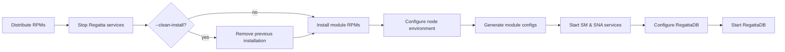

Once you have a [config](../configuration/overview.mdx), RDT sets up your nodes in a
fixed sequence of steps. This page explains what happens, in order, so you know what to
expect on your machines. For the actual commands, see
[RegattaDB Lifecycle](./lifecycle.mdx).

## The setup pipeline

<Steps>
  <Step title="Distribute RPMs">
    Copy the RPM bundle to every target node.
  </Step>
  <Step title="Stop Regatta services">
    Halt SM, SNA, and RegattaDB before touching packages.
  </Step>
  <Step title="Remove previous installation (optional)">
    Only when running with `--clean-install`. Skip otherwise.
  </Step>
  <Step title="Install module RPMs">
    Install the distributed module packages.
  </Step>
  <Step title="Configure node environment">
    Apply per-node environment settings.
  </Step>
  <Step title="Generate module configs">
    Render configuration files for each module.
  </Step>
  <Step title="Start SM & SNA services">
    Bring the control plane services online.
  </Step>
  <Step title="Configure RegattaDB">
    Apply cluster and storage configuration.
  </Step>
  <Step title="Start RegattaDB">
    Start the database and verify the cluster is healthy.
  </Step>
</Steps>

## What each step does

1. **Distribute RPMs**: distributes Regatta RPM packages to every node.
2. **Stop Regatta services**: stops any currently running Regatta services (not other,
   unrelated services on the node) before making changes.
3. **Remove previous installation** (only with `--clean-install`): wipes prior state
   before reinstalling. See [What Changes on Your Nodes](../advanced/node-system-changes.mdx)
   for exactly what is removed and what is preserved.
4. **Install module RPMs**: installs only the packages for the modules you've actually
   configured on that node (e.g. a node with only SNA and RDB doesn't get the SM package).
5. **Configure node environment**: prepares storage devices and performance tuning for
   the modules on that node. See
   [What Changes on Your Nodes](../advanced/node-system-changes.mdx) for the full details
   (device ownership, filesystem setup, performance tuning).
6. **Generate module configs**: writes each module's configuration file from your
   RegattaDB config.
7. **Start SM & SNA services**: starts the System Manager and SNA as node-level
   services and enables them to start on boot. Other module types (RDB, GDD, DCM,
   Sequencer) aren't node-level services; they're started by the System Manager itself
   in the next two steps.
8. **Configure RegattaDB**: connects to the running System Manager and registers your
   nodes, storage devices, and modules with it.
9. **Start RegattaDB**: tells the System Manager to start every configured module,
   bringing the database online.

## Next steps

Continue to [RegattaDB Lifecycle](./lifecycle.mdx) for the commands that run this
pipeline (`setup`, `create-cluster`, and friends).
