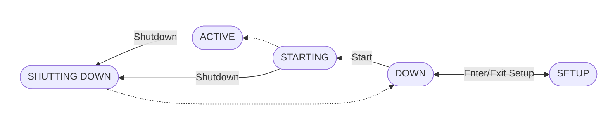

## System States

**The Regatta system has a state, which could be one of the following:**

**DOWN**: The system is not operational – the RDB modules don’t accept client connections and system configuration commands are not available. The system can be queried (using the `MANAGE `… `SHOW `commands) but the only two operations accepted in this state are to activate the system or to enter the SETUP state.

**SETUP**: The system is not operational – the RDB modules don’t accept client connections. System configuration commands are allowed.

**STARTING**: The system is in the process of becoming active. The RDB modules may start accepting client connections but are not yet fully operational. System configuration commands are not allowed.

**ACTIVE**: The system is operational, accepting client connections. Some system configuration commands are allowed.

**SHUTTING DOWN**: The system is in the process of shutting down. The RDB modules close all the client connections and stop accepting new connections. System configuration commands are not allowed.



### System Commands

All the system-wide commands begin with the prefix `MANAGE SYSTEM`

#### SYSTEM START

Synopsis

```text
MANAGE SYSTEM START
```

The command is accepted only if the current system state is `DOWN`. The result of executing the command is a state change to `STARTING`.

#### SYSTEM SHUTDOWN

**Synopsis**

```text
MANAGE SYSTEM SHUTDOWN [ WAIT seconds ]
```

The command is accepted only if the current system state is either `ACTIVE `or `STARTING`.

The command synchronously waits for the shutdown to be completed and returns only when the system state has changed to `DOWN` .

**Parameters**

`WAIT seconds`

Optional parameter. The system will wait up to the specified number of seconds for ongoing transactions to finish before shutting down. If any transaction remains active after that time elapsed, it will be aborted. By default, ongoing transactions are immediately aborted.

#### SYSTEM ENTER SETUP

**Synopsis**

```text
MANAGE SYSTEM ENTER SETUP
```

The command is accepted only if the current system state is `DOWN`. The result of executing the command is a state change to `SETUP`.

#### SYSTEM EXIT SETUP

**Synopsis**

```text
MANAGE SYSTEM EXIT SETUP
```

The command is accepted only if the current system state is `SETUP`. The result of executing the command is a state change to `DOWN`.

#### SYSTEM MODIFY

This command modifies parameters of the system.

**Synopsis**

```text wrap
MANAGE SYSTEM MODIFY 
	[ RDB_FAILURE_THRESHOLD (FAILURES num_failures DURATION time_window) [ , ... ] ] 
	[ DCM_FAILURE_THRESHOLD (FAILURES num_failures DURATION time_window) [ , ... ] ] 
	[ GDD_FAILURE_THRESHOLD (FAILURES num_failures DURATION time_window) [ , ... ] ] 
	[ SEQUENCER_FAILURE_THRESHOLD (FAILURES num_failures DURATION time_window) [ , ... 
] ]
```

**Parameters**

`RDB_FAILURE_THRESHOLD`

Optional parameter. Specify up to 4 failure thresholds for each RDB module. Each threshold is specified by a number of failures and time window (in seconds). A module is restarted automatically when it fails, as long as it hasn’t reached the threshold. Once a threshold is reached, the module is not restarted, and it remains in state `DOWN `until it is started with the `MODULE START` command.

For example, when specifying `RDB_FAILURE_THRESHOLD (FAILURES 3 DURATION 60), (FAILURES 5 DURATION 3600)`, an RDB module will move to state `DOWN `if it fails 3 times within 60 seconds, or if it fails 5 times within an hour.

<Note>
  The specified failure thresholds replace the existing set of thresholds.
</Note>

`DCM_FAILURE_THRESHOLD, GDD_FAILURE_THRESHOLD, SEQUENCER_FAILURE_THRESHOLD`

Optional parameters. These parameters specify up to 4 failure thresholds for the DCM, GDD and SEQUENCER modules, respectively. See description of RDB\_FAILURE\_THRESHOLD above.

#### SYSTEM SHOW

This command shows the state and other attributes of the system.

**Synopsis**

```text
MANAGE SYSTEM SHOW [ DETAILED ]
```

**Output**

The output of the command is tabular, containing a single row. The following table lists the columns of the output. The columns marked as “Basic” appear in the basic output, the other columns appear only in the detailed output.

| Name | Type | Basic | Description |
| --- | --- | :-- | --- |
| STATE | String | <Icon icon="check" /> | The state of the system. |
| NUM\_NODES | Number |  | The number of nodes. |
| NUM\_RDB\_MODULES | Number |  | The number of RDB modules. |
| NUM\_UNAVAILABLE\_NODES | Number |  | The number of nodes in state `NOT AVAILABLE` |
| NUM\_INACTIVE\_MODULES | Number |  | The number of modules that are not in `ACTIVE `state |

<Note>
  See description of the failure thresholds in the [SYSTEM MODIFY](/states-and-commands) command.
</Note>